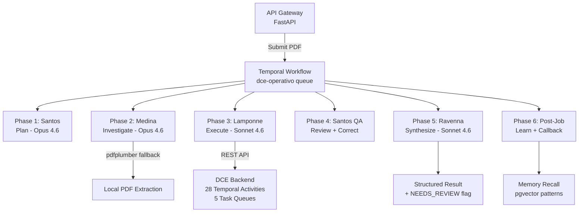

# Simuladores

**Current Version:** v1.8.0 | **Python:** 3.11+

Domain-locked, Temporal-orchestrated agent system for production automation of business processes. Inspired by [Los Simuladores](https://es.wikipedia.org/wiki/Los_simuladores), each operativo is planned and executed by a four-agent brigada — Santos, Medina, Lamponne, and Ravenna — resolving exactly one class of task for exactly one domain, deterministically, with an auditable trail.

## Overview

Simuladores wraps existing AI services — starting with the [DCE Backend](https://github.com/fierro-ltd/genai-document-compliance) and the [IDP Platform](https://idp-platform-template.demos.fierro.co.uk/) — adding intelligent planning, document investigation, quality assurance, and synthesis without modifying the underlying systems.

### The Brigada

Four specialized agents orchestrated via Temporal:

- **Santos** (Orchestrator) — plans the operativo, performs QA review, auto-corrects issues
- **Medina** (Investigator) — reads input documents, scans for prompt injection, builds ground truth
- **Lamponne** (Executor) — calls domain APIs, runs sandboxed Python for normalizations
- **Ravenna** (Synthesizer) — assembles final output, permission-gated delivery

### Operativo Lifecycle

Every job follows six phases, each a durable Temporal Activity:

```
Intake -> Plan -> Investigate -> Execute -> Citation Completeness + Web Verify -> QA + Correction -> Synthesize -> Post-Job
```

The system always delivers. Auto-correction loops run up to 3 attempts, then deliver with a NEEDS_REVIEW flag. No silent failures.

## Architecture

> Diagrams use [Mermaid](https://mermaid.js.org/) syntax and render natively on GitHub. See `docs/DIAGRAMS.md`.



### Key Design Decisions

| Decision | Rationale |
|----------|-----------|
| Wrapper, not rewrite | Zero risk to working DCE Backend. Incremental adoption. |
| Anthropic SDK via Vertex AI | Fine-grained prompt cache control, compaction API via Google Vertex AI. |
| Temporal only | No LangChain, no AutoGen. Durable workflows with crash recovery. |
| Domain isolation by construction | DCE worker process has no HAS tools registered. Not config — code. |
| Security by architecture | Injection resistance and credential isolation are structural, not prompt-based. |

## Tech Stack

| Component | Technology |
|-----------|-----------|
| Orchestration | Temporal.io |
| Agents | Python 3.11+ with Anthropic SDK via Vertex AI |
| Semantic memory | PostgreSQL + pgvector |
| Session state | StorageBackend (local filesystem / GCS) |
| Code sandbox | Docker (rootless, no network) |
| API gateway | FastAPI |
| LLM models | Claude Opus 4.6 (Santos, Medina) / Claude Sonnet 4.6 (Lamponne, Ravenna) |

Open source stack. Only external API dependency: Anthropic via Google Vertex AI.

## In-Scope Domains

| Domain | Status | Description |
|--------|--------|-------------|
| DCE Work Order | Reference implementation | Document Compliance Engine validation (regulatory compliance) |
| IDP | Connected | Intelligent Document Processing — document extraction with plugins and schemas |
| Healthcare AI Suite | Future | Healthcare AI processing audits |

## Development

### Prerequisites

- Python 3.11+
- Docker & Docker Compose
- Google Cloud project with Vertex AI enabled

### Quick Start

```bash
# Configure environment
cp .env.example .env
# Edit .env with your GOOGLE_CLOUD_PROJECT and VERTEX_REGION

# Start infrastructure
docker compose up -d

# Run DCE worker
python -m agent_harness.workers.dce

# Run IDP worker
python -m agent_harness.workers.idp

# Run API gateway
python -m agent_harness.gateway
```

### Testing

```bash
pytest tests/
```

- **Cache tests** (`tests/cache_tests/`) — validate prompt layer ordering; CI fails on cache breaks
- **Injection tests** (`tests/injection_tests/`) — 10+ synthetic poisoned documents; all must be flagged
- **Integration tests** (`tests/integration/`) — end-to-end operativo tests with sample compliance PDFs

### Diagram Rendering

```bash
npm install
npm run docs:diagrams
```

This generates rendered SVGs from all markdown Mermaid blocks into `docs/diagrams/` and writes `docs/diagrams/index.json`.

## Project Structure

```
simuladores/
├── core/              Base classes, permissions, registry
├── prompt/            Prompt assembly (most critical), injection guard, compaction
├── memory/            Domain, session, and semantic memory stores
├── agents/            Santos, Medina, Lamponne, Ravenna executors
├── llm/               AnthropicClient (Vertex AI), ToolHandler
├── sandbox/           Docker v1 + Monty v2 stub (stable interface)
├── domains/dce/       DCE domain: memory file, tools, worker, operativo
├── domains/idp/       IDP domain: document extraction with plugins
├── workflows/         Temporal workflow definitions
├── activities/        Temporal activities (@activity.defn + factory)
├── workers/           Domain Temporal workers (DCE, IDP)
├── storage/           StorageBackend protocol (local/GCS)
├── gateway/           FastAPI intake, dispatch, status
├── observability/     Logging, metrics, benchmarks
├── tests/             Cache, injection, integration tests + fixtures
└── docs/              Architecture and design documents
```

## Documentation

- [Architecture](docs/ARCHITECTURE.md)
- [Data Flow](docs/DATA_FLOW.md)
- [Vision](docs/VISION.md)
- [Diagram Rendering](docs/DIAGRAMS.md)
- [Changelog](CHANGELOG.md)
- [Architecture](docs/ARCHITECTURE.md) — full technical design

## Related Systems

- [dispatch](https://github.com/fierro-ltd/dispatch) — email routing service (sends jobs to Simuladores)
- [DCE Backend](https://github.com/fierro-ltd/genai-document-compliance) — existing DCE validation (Simuladores wraps its 20 Temporal activities)
- [IDP Platform](https://idp-platform-template.demos.fierro.co.uk/) — document extraction platform (Simuladores wraps its 19 REST endpoints)
- [Healthcare AI Suite](https://github.com/fierro-ltd/healthcare-ai-suite) — future domain target

## Roadmap

| Version | Sprint | Focus |
|---------|--------|-------|
| v0.1-v0.6 | 1-6 | Foundation: core types, PromptBuilder, injection guard, agents, memory, domains |
| v0.7-v1.0 | 7-13 | Runtime: SDK client, Temporal workflows, activities, DCE worker, gateway |
| v1.1 | 14-15 | Cortex Bulletin, HAS domain, IDP checklist |
| v1.2 | 16-18 | Security hardening, GCS storage, cache monitoring, semantic patterns |
| v1.3 | 19 | Vertex AI migration (AsyncAnthropicVertex) |
| v1.4 | 20 | DCE production: real PDF extraction via DCE Backend, e2e test |
| v1.9 | 24 | IDP domain connected to IDP Platform (12 operations, 14 HTTP handlers) |
| v2.0 | Next | Compaction API integration, PostgresGraphStore |

### Sources & References

| Topic | Source |
|-------|--------|
| Prompt layer ordering | Thariq (Anthropic) — cache-optimized prompt assembly |
| Harness engineering | [LangChain blog: Improving Deep Agents](https://blog.langchain.com/improving-deep-agents-with-harness-engineering/) |
| Cortex memory model | [Spacebot](https://github.com/spacedriveapp/spacebot) — cross-session memory |
| Agent loop patterns | [NanoClaw](https://github.com/qwibitai/nanoclaw) — lightweight agent loops |
| Compaction API | [Anthropic Compaction](https://docs.anthropic.com/en/docs/build-with-claude/prompt-caching#prompt-cache-types) |
| Vertex AI SDK | [Anthropic Vertex AI](https://docs.anthropic.com/en/api/claude-on-vertex-ai) |
