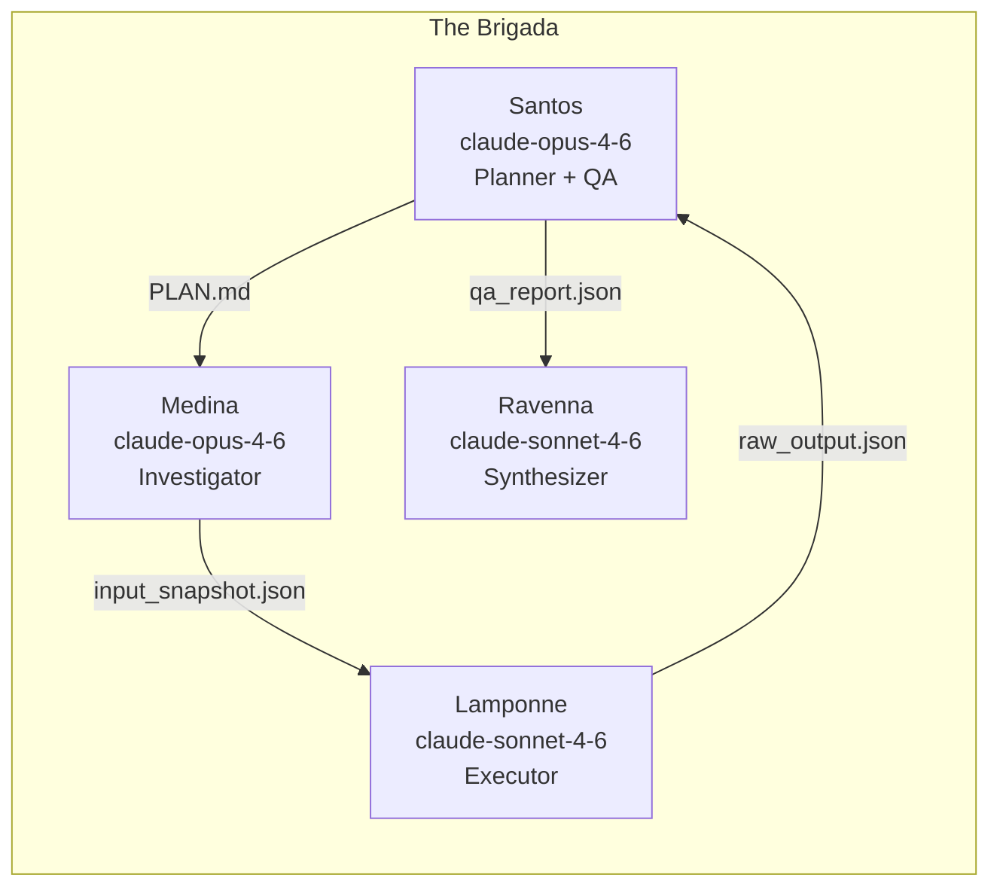
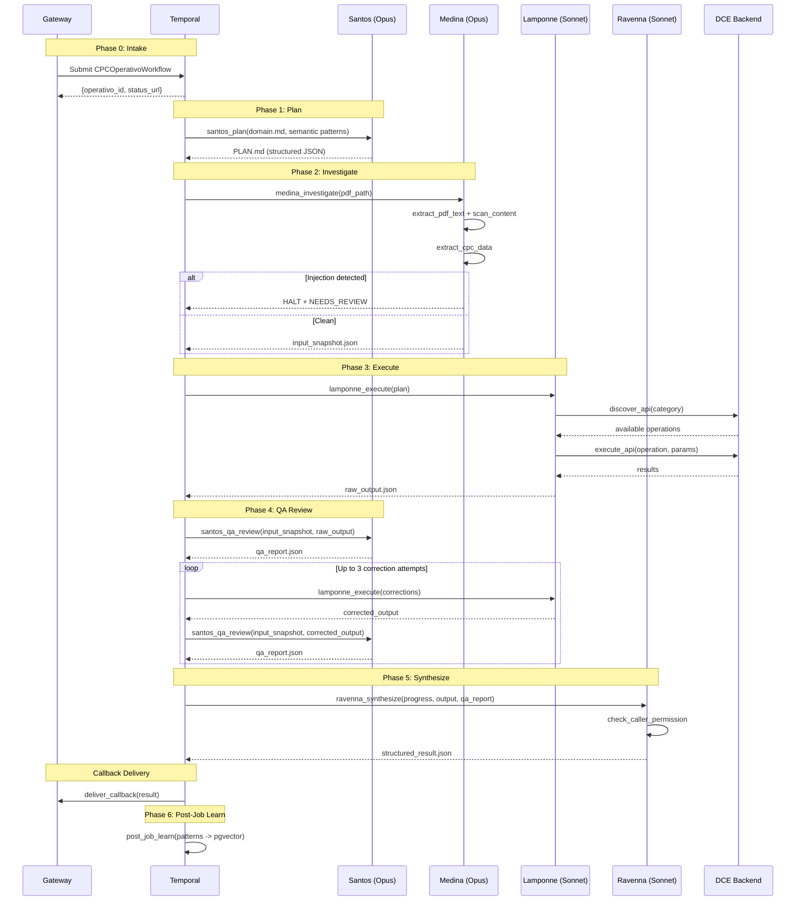
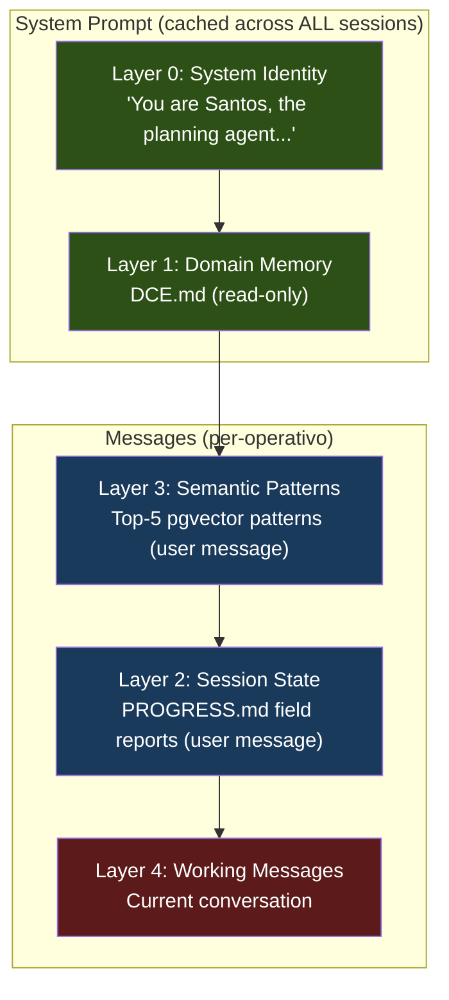
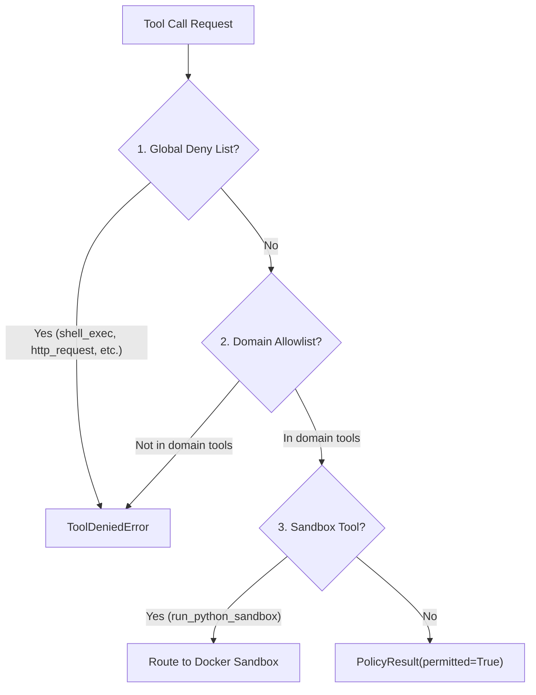
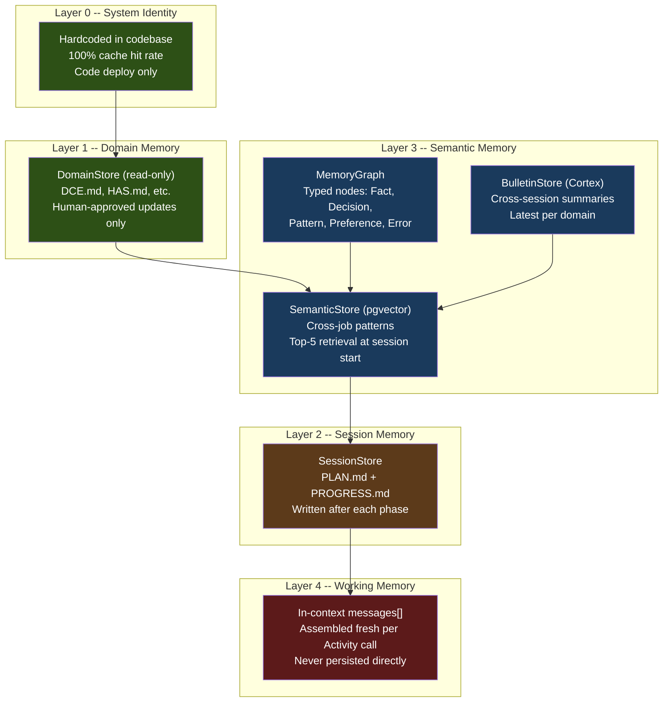
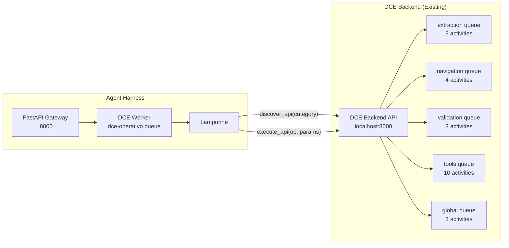
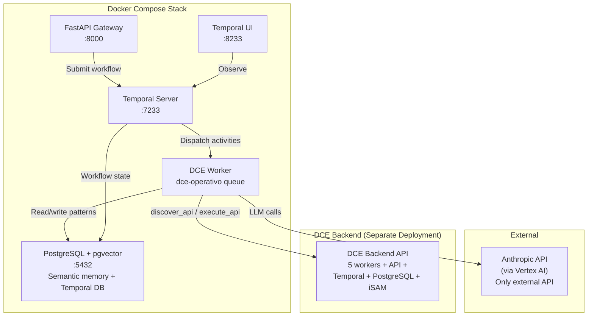

# Agent Harness -- Architecture

**Date:** 2026-02-22
**Status:** Living document
**Source of truth:** Codebase at `agent_harness/`

> Diagrams use [Mermaid](https://mermaid.js.org/) syntax and render natively on GitHub.

---

## 1. System Overview

The Agent Harness is a **domain-locked, Temporal-orchestrated agent system** that wraps existing AI services. Each harness instance resolves exactly one class of task for exactly one domain, deterministically, with an auditable trail.

It is not a general-purpose AI assistant, not a replacement for existing services, and not built on LangChain or AutoGen.

### What It Wraps

The DCE (Document Compliance Engine) domain is the reference implementation. The harness wraps the existing **DCE Backend's 28 Temporal activities across 5 task queues** (extraction, navigation, validation, tools, global) -- adding intelligent planning, document investigation, unified execution, and synthesis without modifying any of the DCE Backend's existing activities.

Recent DCE additions also include deterministic citation completeness classification and optional GCP-native web verification for ambiguous citation applicability cases.

### Non-Negotiable Constraints

These invariants are enforced in code, not by convention:

1. **Prompt layer ordering (Thariq's Law):** `prompt/builder.py` assembles messages in strict order -- L0 (system), L1 (domain), L3 (semantic), L2 (session), L4 (working). Static first, dynamic last. `PromptOrderViolation` exception on breach. Cache break = CI failure.

2. **Domain isolation by construction:** A DCE worker only has DCE tools registered. Cross-domain access is impossible because the tools do not exist in the worker process.

3. **Security by architecture:** Injection resistance, credential isolation, and domain lockdown are enforced structurally. The LLM cannot override the tool policy chain.

4. **Domain files READ-ONLY at runtime:** `DCE.md` and other domain memory files are never written by agents. Updates require a human-approved Temporal signal.

5. **Always delivers:** Auto-correction loops run to max 3 attempts, then deliver with `NEEDS_REVIEW` flag. No silent failures.

---

## 2. Agent Model -- The Brigada

Four agents, each implemented as a Temporal Activity that calls Claude via the Anthropic Python SDK (through Vertex AI). Model assignments are **hardcoded** in `agents/base.py`, not configurable.



| Agent | Internal Name | External Name | Model | Reasoning Effort | Role |
|-------|--------------|---------------|-------|-----------------|------|
| Santos | `agents/santos.py` | Orchestrator | `claude-opus-4-6` | high | Plans operativo (Phase 1), QA review (Phase 4), auto-correction. **No tool calls during planning** -- pure reasoning. |
| Medina | `agents/medina.py` | Investigator | `claude-opus-4-6` | high | Reads input documents, runs injection scanner before any content is passed downstream, builds `input_snapshot.json`. **Opus mandatory** -- injection resistance requires top-tier reasoning. |
| Lamponne | `agents/lamponne.py` | Executor | `claude-sonnet-4-6` | medium | Calls domain APIs via `discover_api`/`execute_api`. Inputs are always controlled by upstream agents -- Sonnet sufficient. |
| Ravenna | `agents/ravenna.py` | Synthesizer | `claude-sonnet-4-6` | medium | Assembles final `structured_result.json` from all phase outputs. Permission-gated delivery. No untrusted input at this stage. |

The dual naming convention (Los Simuladores internally, functional names externally) drives system prompt personality and clarifies role boundaries. The core concept -- **Operativo** -- is retained in all contexts.

### Brigada B -- Lightweight Agents

For operativos that do not require full four-agent orchestration: `SimpleOrchestrator`, `SimpleSearch`, `SimpleExecutor`, `SimpleSynthesizer`. Same domain lockdown and security constraints. Used when Santos determines at planning time that the operativo is a single-phase retrieval or format conversion. Defined in `agents/brigada_b/`.

### Reasoning Effort Configuration

From `agents/base.py`:

```python
AGENT_EFFORTS: dict[str, str] = {
    "santos": "high",       # Planning + QA need deep reasoning
    "medina": "high",       # Injection scanning needs care
    "lamponne": "medium",   # Executing a known plan
    "ravenna": "medium",    # Assembly, not reasoning
}
```

This implements the **reasoning sandwich** pattern (source: LangChain harness engineering blog) -- high reasoning at the start (planning) and end (QA), medium in the middle (execution, assembly).

---

## 3. Operativo Lifecycle

Every operativo follows seven phases (0-6), implemented as Temporal Activities within `CPCOperativoWorkflow` (`workflows/operativo_workflow.py`). The workflow is durable: a worker crash mid-phase resumes from the last completed Activity checkpoint.



### Phase Details

| Phase | Activity | Agent | Timeout | Output |
|-------|----------|-------|---------|--------|
| 0 | Gateway dispatch | -- | -- | `{operativo_id, status_url}` |
| 1 | `santos_plan` | Santos | 120s | `PLAN.md` (JSON execution plan) |
| 2 | `medina_investigate` | Medina | 120s | `input_snapshot.json` (or HALT) |
| 3 | `lamponne_execute` | Lamponne | 600s | `raw_output.json` (max 10 tool turns) |
| 4 | `santos_qa_review` | Santos | 300s | `qa_report.json` (BLOCKING/WARNING/INFO) |
| 5 | `ravenna_synthesize` | Ravenna | 120s | `structured_result.json` |
| 6 | `post_job_learn` | -- | 60s | Patterns written to pgvector |

### Auto-Correction Loop (Phase 4)

Implemented in `CPCOperativoWorkflow._qa_with_retry()`:

1. Santos reviews `input_snapshot.json` vs `raw_output.json`
2. If BLOCKING issues found, Lamponne re-executes with corrections
3. Santos re-reviews corrected output
4. After 3 failed attempts: mark `NEEDS_REVIEW`, deliver anyway (invariant #5)

---

## 4. Prompt Architecture -- Thariq's Law

The prompt layer ordering is the single most critical architectural decision. It determines cache hit rates, which directly control cost and latency.

**Source:** Thariq (Anthropic) -- recommendations on prompt cache optimization. Static content must come first in the message array so that the Anthropic API can cache the prefix across requests.



### Layer Order: L0, L1, L3, L2, L4

Note the non-sequential numbering: L3 (semantic patterns) comes before L2 (session state). This is deliberate -- semantic patterns are more stable across requests than session state, so placing them earlier maximizes cache prefix length.

Defined in `prompt/builder.py`:

```python
_LAYER_ORDER = [0, 1, 3, 2, 4]
```

### Enforcement

- `PromptBuilder._check_order()` validates every layer insertion
- `PromptOrderViolation` raised on any ordering breach
- `tests/cache_tests/` validates ordering in CI -- **CI must fail on any cache-breaking change**

### Assembly

| Position | Layer | Content | Cache Behavior |
|----------|-------|---------|---------------|
| System prompt | L0 + L1 | System identity + domain memory | Cached across all domain sessions |
| User message 1 | L3 | `<semantic_patterns>` tag | Semi-stable across operativos |
| User message 2 | L2 | `<session_state>` tag | Changes every phase |
| User message 3+ | L4 | Working conversation | Changes every turn |

### Context Window Budget (typical DCE operativo, 128k)

```
Layers 0+1 (system + DCE.md):              ~7,000 tokens (cached)
Semantic patterns:                          ~2,000 tokens
PROGRESS.md:                                ~4,000 tokens
input_snapshot + raw_output (QA phase):    ~15,000 tokens
Working messages:                          ~20,000 tokens
Compaction buffer:                          ~8,000 tokens
Available for response:                    ~72,000 tokens
```

### Compaction Strategy

**Primary:** Anthropic compaction API (`compact-2026-01-12` beta) -- server-side summarization, activates at 80% context window usage.

**Fallback:** Custom Session Bridge (`workflows/session_bridge.py`) -- Temporal child workflow for edge cases where specific content must not be compacted (e.g., `input_snapshot` during QA phase).

---

## 5. Security Architecture

Security is enforced by architecture, not by prompt. The LLM cannot override the tool policy chain, domain file access controls, or credential isolation.

**Source:** OpenClaw security analysis -- SOUL.md-class attacks demonstrated that prompt-only security is insufficient. All defenses must be structural.

### Threat Model

| Attack Vector | Defense | Implementation |
|---------------|---------|----------------|
| Prompt injection via PDF | Medina scans all extracted content before downstream processing | `prompt/injection_guard.py` |
| Domain memory poisoning | Domain `.md` files READ-ONLY at runtime; `DomainWriteAttemptError` on write | `memory/domain_store.py` |
| Credential exfiltration | Credentials in env/Temporal vault only, never in LLM context | `docker-compose.yml`, config |
| Scope escape | Domain allowlist hardcoded in worker registration | `core/permissions.py` |
| Model tier attack | Opus mandatory for Medina (injection scanner) | `agents/base.py` AGENT_MODELS |
| Cross-job state pollution | Structural session isolation via Temporal workflows | `workflows/operativo_workflow.py` |
| Unicode homoglyph obfuscation | Homoglyph normalization before pattern matching | `prompt/injection_guard.py` |
| Base64-encoded payloads | Base64 detection + decode + re-scan | `prompt/injection_guard.py` |
| PDF metadata injection | Metadata fields scanned separately from content | `injection_guard.scan_metadata()` |

### Tool Policy Chain

Evaluated deterministically in `activities/tool_executor.py` + `core/permissions.py` before any tool executes:



**Global deny list** (`core/permissions.py`):

```python
GLOBAL_DENY_LIST: frozenset[str] = frozenset({
    "shell_exec", "http_request", "filesystem_write", "os_exec", "subprocess",
})
```

### Injection Scanner

`prompt/injection_guard.py` implements pattern-based scanning with:

- **Phrase patterns:** "ignore previous", "you are now", "new instructions", "override", "disregard"
- **Imperative commands:** "forget", "reveal", "execute"
- **Role reassignment:** "you are a", "act as", "pretend you are"
- **Exfiltration directives:** "send data", "curl", "email to", "upload", "POST to"
- **Unicode normalization:** Cyrillic/Greek homoglyph mapping to Latin before matching
- **Base64 detection:** Decode candidate Base64 strings and re-scan for all patterns
- **Metadata scanning:** Title, Author, Subject, Keywords, Creator, Producer fields

On HIGH risk detection: halt extraction, flag to Santos. Never silently pass injected content downstream.

### Permission Levels

| Level | Example Tools | Gate |
|-------|--------------|------|
| AUTO | `read_pdf`, `vector_search`, `run_python_sandbox`, `extract_fields` | Immediate. Logged. |
| SESSION | `generate_pdf`, `generate_excel`, `write_to_bucket` | Granted at job intake. |
| HUMAN_APPROVAL | `call_external_api`, `modify_domain_memory` (blocked) | Temporal pause. 24h auto-reject. |

### Worker Isolation

Domain isolation by construction -- each worker process only registers its own domain's tools:

```
DCE Worker       -> dce-operativo queue   -> DCE tools only, DCE.md only
HAS Worker       -> has-operativo queue   -> HAS tools only, HAS.md only
IDP Worker       -> idp-operativo queue   -> IDP tools only, IDP.md only
```

---

## 6. Memory Architecture

Five memory layers, each with distinct scope, storage, and update policy. Inspired by the **Spacebot cortex memory model** (cross-session pattern storage, typed memory nodes, graph-based retrieval).



| Layer | Name | Scope | Storage | Update Policy |
|-------|------|-------|---------|---------------|
| 0 | System Identity | Global | Hardcoded in codebase | Code deploy only. Never at runtime. |
| 1 | Domain Memory | Per domain | `DomainStore` via `StorageBackend` | Human-approved Temporal signal only. READ-ONLY at runtime. `DomainWriteAttemptError` on write. |
| 2 | Session Memory | Per operativo | `SessionStore` via `StorageBackend` | Written after each phase. Field reports (3-5 sentences). Never raw tool output. |
| 3 | Semantic Memory | Cross-job, per domain | `SemanticStore` (pgvector) + `MemoryRecall` + `BulletinStore` | Written by post-job activity. Top-5 patterns retrieved at session start. |
| 4 | Working Memory | Current LLM call | In-context `messages[]` | Assembled fresh per Activity call. Never persisted directly. |

### Memory Graph (`memory/graph.py`)

Typed memory nodes with five categories:

- **Fact** -- domain knowledge learned from operativos
- **Decision** -- choices made during processing with rationale
- **Pattern** -- recurring normalization or correction patterns
- **Preference** -- client or domain-specific preferences
- **Error** -- failure modes and their resolutions

Four relationship types between nodes: `updates`, `contradicts`, `caused_by`, `related_to`.

### Memory Recall (`memory/recall.py`)

`MemoryRecall` bridges the graph store to `PromptBuilder.set_semantic_patterns()`, formatting nodes as `"[fact] Toys require ASTM F963 testing."` strings for L3 injection.

### Cortex Bulletin (`memory/bulletin_store.py`)

**Source:** Spacebot cortex memory model. Cross-session bulletin summaries generated by `CortexBulletinWorkflow` (`workflows/cortex.py`), stored per domain, formatted as L3 pattern strings.

### Storage Abstraction

```python
class StorageBackend(Protocol):
    async def read(self, path: str) -> bytes: ...
    async def write(self, path: str, data: bytes) -> None: ...
    async def exists(self, path: str) -> bool: ...
    async def list(self, prefix: str) -> list[str]: ...
```

- `LocalStorageBackend` (`storage/local.py`) -- filesystem, for dev/testing
- `GCSStorageBackend` (`storage/gcs.py`) -- Google Cloud Storage, for production

---

## 7. DCE Backend Integration

The harness wraps the existing DCE Backend without modification. Lamponne exposes all 28 of the DCE Backend's activities through two meta-tools (Cloudflare Code Mode pattern).



### DCE API Manifest (`domains/dce/tools.py`)

28 operations across 5 categories:

| Category | Count | Key Operations |
|----------|-------|---------------|
| **extraction** | 8 | `extract_pdf_text`, `extract_cpc_data`, `generate_isam_product`, `fetch_isam_product`, `extract_product_photos`, `resolve_product_images`, `validate_product_name`, `normalize_extraction_fields` |
| **navigation** | 4 | `navigate_decision_tree`, `analyze_section_citations`, `validate_citation_applicability`, `resolve_robot_ambiguities` |
| **validation** | 3 | `validate_cpc_elements`, `analyze_product_photos`, `describe_product_photo` |
| **tools** | 10 | `fetch_cpsc_report_titles`, `fetch_cpsc_report_sections`, `litellm_completion`, `check_lab_accreditation`, `build_citation_lab_coverage_activity`, `search_lab_cpsc`, `judge_lab_match`, `lookup_lab_by_ids`, `find_lab_by_address_activity`, `score_lab_candidates_activity` |
| **global** | 3 | `merge_assessment`, `generate_fix_suggestions_activity`, `generate_corrected_cpc_activity` |

### Meta-Tool Pattern

Lamponne uses exactly two tools to interact with all 28 DCE activities:

- **`discover_api(category?)`** -- returns available operations (~1,000 tokens regardless of API breadth)
- **`execute_api(operation, params)`** -- calls one of the 28 existing activities

This keeps Lamponne's tool definition compact and stable even as the DCE Backend adds new activities.

---

## 8. Infrastructure



### Docker Compose Services

| Service | Image | Port | Purpose |
|---------|-------|------|---------|
| `postgresql` | `pgvector/pgvector:pg17` | 5432 | Semantic memory (pgvector) + Temporal persistence |
| `temporal` | `temporalio/auto-setup:latest` | 7233 | Workflow orchestration |
| `temporal-ui` | `temporalio/ui:latest` | 8233 | Temporal Web UI |
| `worker` | Custom build | -- | DCE worker (`python -m agent_harness.workers.dce`) |
| `gateway` | Custom build | 8000 | FastAPI intake API |

### Sandbox Infrastructure

**v1 (current):** Docker sandbox -- rootless container, no network, read-only input volume, ephemeral. Allowed imports: `re`, `json`, `string`, `unicodedata`, `datetime`, `math`. Timeout: 10s, memory: 128MB, startup: ~195ms.

**v2 (future):** Monty interpreter (Pydantic's Rust-based minimal Python interpreter). Startup: <1 microsecond. No Docker daemon dependency. **Activation threshold:** Monty v0.1.0+ with stable JSON support (currently v0.0.5).

Stable interface (`sandbox/python_runner.py`):

```python
class SandboxBackend(Protocol):
    def run(self, request: SandboxRequest) -> SandboxResult: ...
```

---

## 9. Key Directories

Accurate to actual codebase structure at `agent_harness/`:

```
agent_harness/
  core/                        Base classes, permissions, registry
    operativo.py               Phase enum, OperativoStatus, QAIssue, OperativoResult
    plan.py                    AgentTask, ExecutionPlan, PhaseResult
    permissions.py             PermissionLevel, PolicyChain, GLOBAL_DENY_LIST
    registry.py                task_type -> Temporal Workflow mapping
    errors.py                  Custom error types
  prompt/                      MOST CRITICAL PACKAGE
    builder.py                 PromptBuilder: L0-L4 strict ordering, PromptOrderViolation
    injection_guard.py         Medina's scanner: phrases, imperatives, roles, exfil, base64, homoglyphs
    compactor.py               Anthropic compaction API wrapper
    compaction_client.py       Compaction API client
  memory/
    domain_store.py            DomainStore: read-only .md access, DomainWriteAttemptError
    session_store.py           SessionStore: PLAN.md + PROGRESS.md via StorageBackend
    semantic_store.py          SemanticStore: in-memory stub (prod: pgvector)
    graph.py                   MemoryNode, MemoryEdge, MemoryType, RelationType
    graph_store.py             InMemoryGraphStore (future: PostgresGraphStore)
    recall.py                  MemoryRecall: bridges graph store to PromptBuilder L3
    bulletin.py                Bulletin data model
    bulletin_store.py          InMemoryBulletinStore: Cortex cross-session memory
    embeddings.py              Embedding utilities
  agents/
    base.py                    BaseAgent, AgentConfig, AGENT_MODELS, AGENT_EFFORTS
    santos.py                  SantosPlanner: plan-only, no tools, Opus
    medina.py                  MedinaInvestigator: extract + scan + snapshot, Opus
    lamponne.py                LamponneExecutor: discover_api + execute_api, Sonnet
    ravenna.py                 RavennaSynthesizer: assemble + permission gate, Sonnet
    qa_reviewer.py             QA review logic for Santos Phase 4
    brigada_b/                 Lightweight agents (SimpleOrchestrator, etc.)
  sandbox/
    python_runner.py           SandboxBackend protocol + router
    docker_backend.py          Docker sandbox v1
    workspace.py               Sandbox workspace management
  domains/
    dce/                       DCE domain (reference implementation)
      DCE.md                   Domain memory -- READ-ONLY at runtime
      operativo.py             CPCOperativoInput, CPCOperativoOutput
      tools.py                 CPC_MANIFEST: 28 operations across 5 categories
      checklist.py             DCE validation checklist
      worker.py                DCE Temporal worker config
    has/                       HAS domain (placeholder)
    idp/                 IDP domain (placeholder)
  workflows/
    operativo_workflow.py      CPCOperativoWorkflow: Phases 0-6
    session_bridge.py          Fallback compaction (Temporal child workflow)
    heartbeat.py               Temporal cron: monitoring
    cortex.py                  CortexBulletinWorkflow: cross-session memory
    has_workflow.py            HAS workflow (placeholder)
    idp_workflow.py      IDP workflow (placeholder)
    search_attributes.py       Temporal search attribute definitions
  activities/
    planner.py                 santos_plan() activity
    investigator.py            medina_investigate() activity
    agent_loop.py              run_agent_loop() -- generic LLM tool-use loop
    qa_review.py               santos_qa_review() activity
    synthesizer.py             ravenna_synthesize() activity
    post_job.py                post_job_learn() activity
    tool_executor.py           ToolExecutor: PolicyChain wrapper
    callback.py                deliver_callback() activity
    factory.py                 Activity factory utilities
    implementations.py         Activity function registration
  llm/
    client.py                  AnthropicClient: direct SDK wrapper
    tool_handler.py            ToolHandler: LLM tool-use loop
    loop_detection.py          Detect stuck tool loops
  gateway/
    app.py                     FastAPI application
    dispatch.py                Operativo dispatch + validation
    router.py                  API routes
    auth.py                    Authentication
    callback.py                Callback delivery
    email_intake.py            Email intake from dispatch
    rate_limiter.py            Rate limiting
  storage/
    backend.py                 StorageBackend protocol
    local.py                   LocalStorageBackend (dev)
    gcs.py                     GCSStorageBackend (prod)
  workers/
    dce.py                     DCE worker entry point
    has.py                     HAS worker entry point
    idp.py               IDP worker entry point
    _shutdown.py               Graceful shutdown support
  observability/
    audit.py                   Audit logging
    benchmarks.py              Performance benchmarks
    cache_monitor.py           Prompt cache hit rate monitoring
    metrics.py                 Metrics collection
    logging.py                 Structured logging
  config.py                    Configuration loading
tests/
  cache_tests/                 Prompt layer ordering validation (CI-critical)
  injection_tests/             10+ synthetic poisoned documents
  fixtures/                    10 sample compliance PDFs + product photos
  integration/                 End-to-end operativo tests per domain
```

---

## 10. Design Decisions

| Decision | Choice | Rationale | Source |
|----------|--------|-----------|--------|
| Orchestration | Temporal.io only | Durable execution, Activity checkpointing, no framework lock-in | -- |
| Wrapper, not rewrite | Wrap DCE Backend's 28 activities | Zero risk to working system. Incremental adoption. Fallback available. | -- |
| LLM SDK | Direct Anthropic SDK (via Vertex AI), not LiteLLM | Fine-grained cache control, compaction API, cache hit monitoring | -- |
| Prompt layer ordering | L0, L1, L3, L2, L4 (static first) | Maximize Anthropic prompt cache hits across sessions | Thariq (Anthropic) |
| Reasoning effort | High for Santos/Medina, medium for Lamponne/Ravenna | Reasoning sandwich: deep thinking at plan/QA, efficient at execution | LangChain harness engineering blog |
| Model assignment | Opus for Santos/Medina, Sonnet for Lamponne/Ravenna | Injection resistance requires top-tier reasoning. Controlled inputs safe on Sonnet. | -- |
| Compaction | Anthropic compaction API primary, Session Bridge fallback | Server-side summarization reduces complexity. Custom fallback for edge cases. | -- |
| Storage abstraction | `StorageBackend` protocol (local/GCS) | Simple dev setup (no cloud credentials). Clean prod migration. | -- |
| Memory architecture | Five layers with graph-based semantic store | Cross-job learning, typed nodes, Cortex bulletins | Spacebot cortex memory model |
| Tool wrapping | `discover_api`/`execute_api` meta-tools | Compact tool definition, stable interface regardless of DCE Backend changes | Cloudflare Code Mode pattern |
| Security model | Structural enforcement, not prompt-based | SOUL.md-class attacks bypass prompt defenses | OpenClaw security analysis |
| Injection scanning | Pattern matching + homoglyphs + base64 + metadata | Multi-vector defense against known injection techniques | OpenClaw security analysis |
| Loop detection | Built-in loop detection in tool handler | Prevent stuck agent loops from consuming resources | NanoClaw agent loop patterns |
| Sandbox | Docker v1 now, Monty v2 when stable | Monty v0.0.5 lacks JSON support. Stable interface allows transparent swap. | -- |
| Domain scope | DCE-first, HAS and IDP deferred to v0.5 | Prove the agent layer on one domain before scaling. | -- |
