# Data Flow — Agent Harness (DCE Domain)

How data moves through the Agent Harness during a DCE operativo, from API intake to final result delivery.

> Diagrams use [Mermaid](https://mermaid.js.org/) syntax and render natively on GitHub.

> Latest workflow update: after Medina/Vision extraction, the DCE flow computes a deterministic citation completeness report and conditionally runs a GCP-native web verification step before QA.

---

## 1. End-to-End Flow

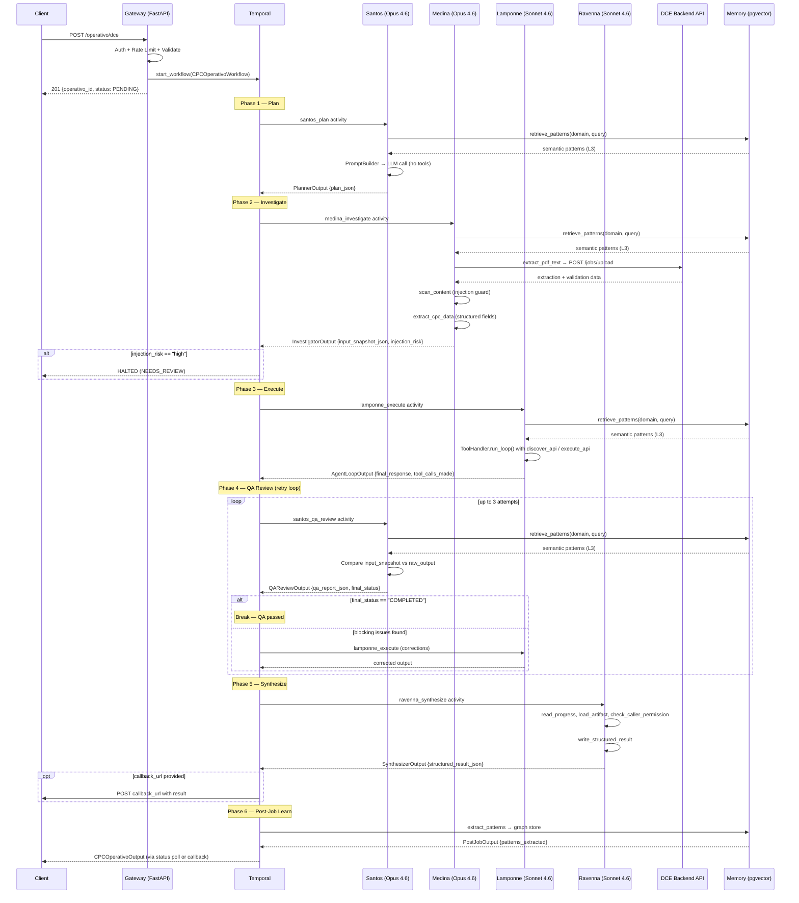

---

## 2. API Intake

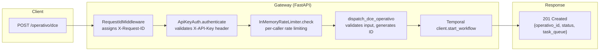

### Request Body (`CPCRequest`)

| Field | Type | Required | Description |
|-------|------|----------|-------------|
| `pdf_path` | `str` | Yes | Absolute path to the DCE PDF file |
| `pdf_filename` | `str` | Yes | Original filename (must end with `.pdf`) |
| `caller_id` | `str` | Yes | Caller identifier for audit and permissions |
| `callback_url` | `str` | No | URL for result delivery callback |
| `skip_navigation` | `bool` | No | Skip Amazon/marketplace navigation step |
| `skip_lab_check` | `bool` | No | Skip lab accreditation verification |
| `skip_photos` | `bool` | No | Skip product photo comparison |

### Dispatch Logic (`gateway/dispatch.py`)

1. Validate required fields (`pdf_path`, `pdf_filename`, `caller_id`)
2. Validate `pdf_filename` ends with `.pdf`
3. Generate `operativo_id` as `dce-{uuid_hex[:12]}`
4. Build `CPCOperativoInput` dataclass
5. Return `DispatchResult(operativo_id, PENDING, workflow_input)`

### Temporal Submission (`gateway/app.py`)

The gateway calls `client.start_workflow(CPCOperativoWorkflow.run, workflow_input, id=operativo_id, task_queue="dce-task-queue")` and returns immediately. The workflow runs asynchronously on the DCE worker.

---

## 3. Phase-by-Phase Data Flow

### Phase 1: Santos Plan

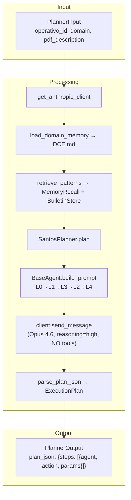

| Aspect | Detail |
|--------|--------|
| **Agent** | Santos (Opus 4.6, reasoning effort: high) |
| **Input** | `operativo_id`, `domain="dce"`, `pdf_description` |
| **LLM call** | Single `send_message` (no tool loop). No tools registered. |
| **Output** | `PlannerOutput` with `plan_json` containing ordered steps |
| **Storage** | `PLAN.md` written to session store (via progress_entries) |
| **Timeout** | 120 seconds |

---

### Phase 2: Medina Investigate

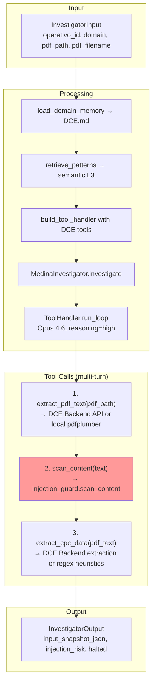

| Aspect | Detail |
|--------|--------|
| **Agent** | Medina (Opus 4.6, reasoning effort: high) |
| **Tools** | `extract_pdf_text`, `scan_content`, `extract_cpc_data` |
| **Input** | `operativo_id`, `domain`, `pdf_path`, `pdf_filename` |
| **LLM call** | Multi-turn tool loop via `ToolHandler.run_loop()` |
| **Output** | `InvestigatorOutput` with `input_snapshot_json`, `injection_risk`, `halted` flag |
| **Halt condition** | `injection_scan_risk == "high"` stops the entire workflow |
| **Timeout** | 120 seconds |

---

### Phase 3: Lamponne Execute

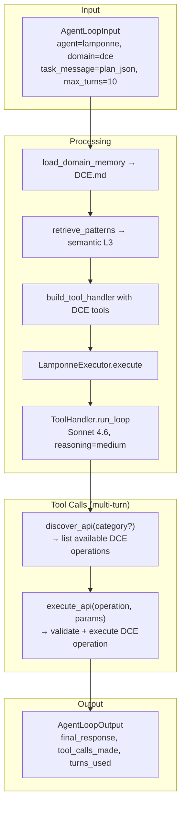

| Aspect | Detail |
|--------|--------|
| **Agent** | Lamponne (Sonnet 4.6, reasoning effort: medium) |
| **Tools** | `discover_api`, `execute_api` |
| **Input** | Plan JSON from Santos (Phase 1) |
| **LLM call** | Multi-turn tool loop, max 10 turns |
| **Output** | `AgentLoopOutput` with final response and tool call log |
| **Timeout** | 600 seconds (10 minutes, longest phase) |

---

### Phase 4: Santos QA Review

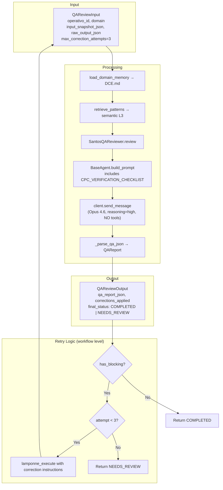

| Aspect | Detail |
|--------|--------|
| **Agent** | Santos (Opus 4.6, reasoning effort: high) |
| **Input** | `input_snapshot_json` (Medina ground truth), `raw_output_json` (Lamponne result) |
| **LLM call** | Single `send_message` (no tool loop). Compares fields via checklist. |
| **Checklist** | `CPC_VERIFICATION_CHECKLIST` injected into prompt for deterministic checking |
| **Output** | `QAReviewOutput` with checks array, severity per check (BLOCKING/WARNING/INFO) |
| **Retry** | Workflow-level loop: if blocking issues, re-execute Lamponne with corrections, up to 3 times |
| **Timeout** | 300 seconds per QA attempt |

---

### Phase 5: Ravenna Synthesize

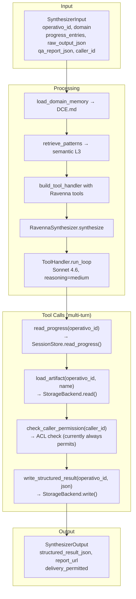

| Aspect | Detail |
|--------|--------|
| **Agent** | Ravenna (Sonnet 4.6, reasoning effort: medium) |
| **Tools** | `read_progress`, `load_artifact`, `write_structured_result`, `check_caller_permission` |
| **Input** | Progress entries from all phases, raw output, QA report, caller ID |
| **Output** | `SynthesizerOutput` with `structured_result_json` and `report_url` |
| **Storage** | Writes `structured_result.json` to session storage |
| **Timeout** | 120 seconds |

---

### Phase 6: Post-Job Learn

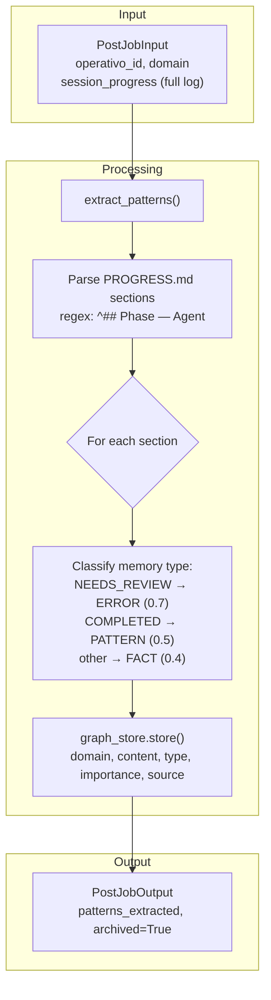

| Aspect | Detail |
|--------|--------|
| **Agent** | None (no LLM call) |
| **Input** | Full session progress log from all phases |
| **Processing** | Regex parsing of PROGRESS.md sections, classify by memory type |
| **Output** | `PostJobOutput` with count of patterns extracted |
| **Storage** | Patterns stored in `InMemoryGraphStore` (production: `PostgresGraphStore` + pgvector) |
| **Timeout** | 60 seconds |

---

## 4. Tool Handler Loop

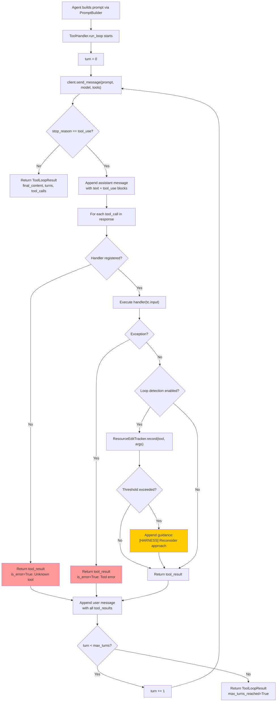

### ResourceEditTracker

The loop detection mechanism tracks per-resource invocation counts. When the same resource (e.g., a specific `execute_api` operation) is called more than `threshold` times (default: 5), guidance text is appended to the tool result:

```
[HARNESS] You have called execute_api on 'validate_cpc' 5 times.
Consider stepping back and reconsidering your approach entirely.
```

This prevents the LLM from entering doom loops on a single resource.

### Key Data Structures

```python
@dataclass(frozen=True)
class ToolLoopResult:
    final_content: str           # Last text response from the LLM
    turns: int                   # Number of send-execute-respond cycles
    tool_calls_made: list[ToolCall]  # All tool calls across all turns
    tool_errors: int             # Count of failed tool executions
    loop_warnings: int           # Count of loop detection warnings
    max_turns_reached: bool      # True if stopped by turn limit
    total_usage: TokenUsage      # Accumulated token usage
```

---

## 5. DCE Backend Dispatch Flow

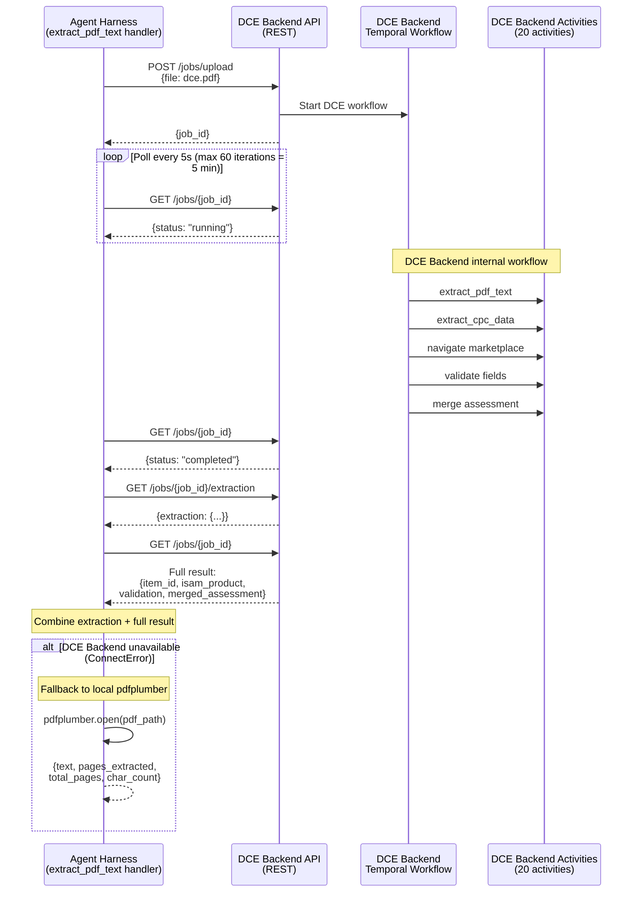

### Response Structure (DCE Backend path)

```json
{
  "job_id": "abc123",
  "status": "completed",
  "extraction": { "...structured DCE fields..." },
  "item_id": "...",
  "isam_product": "...",
  "validation": { "...validation results..." },
  "merged_assessment": { "...merged assessment..." }
}
```

### Response Structure (local fallback path)

```json
{
  "text": "...raw PDF text...",
  "pages_extracted": 3,
  "total_pages": 3,
  "char_count": 12450,
  "source": "local_pdfplumber"
}
```

---

## 6. Prompt Assembly Flow

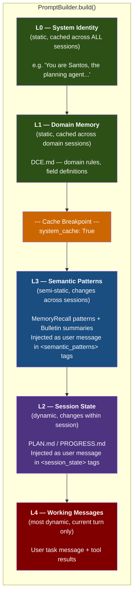

### Layer Ordering (Thariq's Law)

The order is `L0 -> L1 -> L3 -> L2 -> L4` (not sequential by index). L3 comes before L2 because semantic patterns are more stable than session state across turns.

| Layer | Name | Where in API Call | Stability | Content |
|-------|------|-------------------|-----------|---------|
| L0 | System Identity | `system` prompt (first part) | Static (never changes) | Agent identity string |
| L1 | Domain Memory | `system` prompt (appended) | Static per domain | DCE.md content |
| L3 | Semantic Patterns | `messages[0]` (user) + `messages[1]` (assistant ack) | Semi-static | `<semantic_patterns>` XML tags |
| L2 | Session State | `messages[2]` (user) + `messages[3]` (assistant ack) | Dynamic per phase | `<session_state>` XML tags |
| L4 | Working Messages | `messages[4+]` | Most dynamic | Task message, tool results |

### Enforcement

`PromptBuilder._check_order()` raises `PromptOrderViolation` if:
- A layer is set out of order
- A layer is set twice
- A preceding required layer is missing

This is validated in `tests/cache_tests/` and is a CI-blocking failure.

### Assembled Prompt Structure

```python
{
    "system": "You are Santos... \n\n# DCE Domain Memory...",  # L0 + L1
    "messages": [
        # L3: Semantic patterns
        {"role": "user", "content": "<semantic_patterns>\n- [fact] ...\n</semantic_patterns>"},
        {"role": "assistant", "content": "Understood. I'll apply these learned patterns."},
        # L2: Session state
        {"role": "user", "content": "<session_state>\n## Progress...\n</session_state>"},
        {"role": "assistant", "content": "Session state received. Continuing from last checkpoint."},
        # L4: Working message
        {"role": "user", "content": "Create an execution plan for..."},
    ],
    "cache_control": {
        "system_cache": True,
        "system_token_estimate": 1500.0,
    },
}
```

---

## 7. Memory Flow

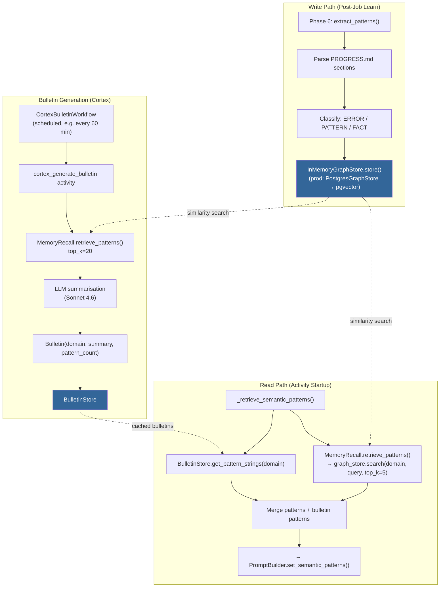

### Memory Types

| Type | Importance | Trigger | Example |
|------|-----------|---------|---------|
| `ERROR` | 0.7 (high) | Phase report contains `NEEDS_REVIEW` | "QA found blocking issues in field X" |
| `PATTERN` | 0.5 (medium) | Phase report contains `status=COMPLETED` | "DCE for toys requires ASTM F963" |
| `FACT` | 0.4 (low) | All other phase reports | "Medina investigated document.pdf" |

### Data Flow Detail

1. **Write (post-job):** After each operativo completes, `extract_patterns()` parses the session progress log. Each phase section is stored as a `MemoryNode` in the graph store with domain, content, memory type, importance score, and source operativo ID.

2. **Read (per-activity):** Every activity calls `_retrieve_semantic_patterns()` which:
   - Calls `MemoryRecall.retrieve_patterns(domain, query, top_k=5)` for similarity search against the graph store
   - Calls `BulletinStore.get_pattern_strings(domain)` for cached cross-session summaries
   - Merges both lists and passes them to `PromptBuilder.set_semantic_patterns()` (L3)

3. **Bulletin generation (Cortex):** The `CortexBulletinWorkflow` runs on a schedule. It retrieves up to 20 recent patterns from the graph store, sends them to the LLM for summarisation, and stores the resulting `Bulletin` in the `BulletinStore`. This compressed summary is then available to all future activities via the read path.

### Storage Backends

| Environment | Graph Store | Embedding | Bulletin Store |
|-------------|------------|-----------|----------------|
| Development | `InMemoryGraphStore` | `FakeEmbeddingClient(dim=8)` | `InMemoryBulletinStore` |
| Production | `PostgresGraphStore` | Real embedding model | Persistent store (TBD) |
