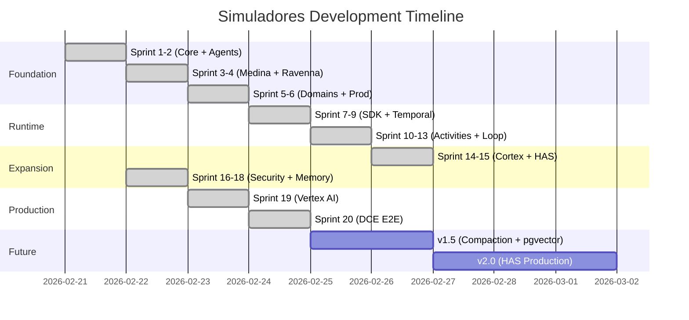

# Simuladores — Vision

> Diagrams use [Mermaid](https://mermaid.js.org/) syntax and render natively on GitHub.

## 1. Mission

Testing, inspection, and certification (TIC) organizations review compliance documents — certificates, audit reports, test results — to ensure products meet regulatory standards before they reach consumers.

Simuladores automates compliance document analysis and intelligent document processing. It starts with DCE (Document Compliance Engines) for regulatory compliance and IDP (Intelligent Document Processing) for structured data extraction — domains where precision, auditability, and determinism matter.

The goal is straightforward: transform manual, error-prone document review into deterministic, auditable AI-driven analysis. Not to replace human judgment, but to ensure that every document is read completely, every field is cross-referenced, and every discrepancy is surfaced — consistently, every time.

---

## 2. Design Philosophy

Simuladores is built on six principles that constrain every design decision:

**Domain-locked by construction, not configuration.** A DCE worker cannot call IDP tools because those tools do not exist in its process. There is no configuration file that could be edited to change this. The isolation is structural.

**Temporal-only orchestration.** No LangChain, no AutoGen, no custom DAG runners. Temporal provides workflow durability, activity retries, signal-based human gates, and cron scheduling. A worker crash mid-phase resumes from the last completed activity checkpoint. Durability over flexibility.

**Multi-provider LLM support.** Agents reference logical roles (`capable` for deep reasoning, `fast` for execution) rather than specific models. A single environment variable (`SIMULADORES_PROVIDER_PROFILE`) selects the deployment profile — Anthropic Vertex AI (default, with prompt caching and compaction API), OpenRouter (cloud gateway for validation), LiteLLM (self-hosted proxy supporting 100+ backends), or local Ollama/vLLM (air-gapped deployments). The provider abstraction preserves Anthropic-specific features like cache control when available while gracefully degrading for providers that don't support them.

**Security by architecture, not by prompt.** Injection resistance is structural: Medina scans all extracted content before it passes downstream, the tool policy chain is evaluated deterministically before any tool executes, and domain memory files are read-only at runtime. The LLM cannot override any of these controls.

**Always delivers.** Auto-correction loops run up to three attempts. If blocking issues remain, Simuladores delivers with a NEEDS_REVIEW flag and documents every finding. Silent failure is not an option — a flagged result is always better than no result.

**Open-source stack.** The entire stack — Temporal, PostgreSQL, pgvector, Docker, FastAPI — is open source and self-hostable. Default LLM provider is Anthropic via Vertex AI, but fully air-gapped deployments are supported via LiteLLM + vLLM/Ollama with no external API dependencies.

---

## 3. Timeline

Simuladores went from architecture design to a production-ready DCE pipeline in 20 sprints — foundation, runtime wiring, domain expansion, security hardening, Vertex AI migration, and end-to-end DCE processing with real PDFs against the DCE Backend's Temporal activities. The IDP domain was connected in sprint 24, validating the multi-domain architecture.

---

## 4. Current State (v4.0.0)

The DCE domain is fully operational with multi-provider LLM support. Real PDF extraction flows through the DCE Backend's Temporal activities, orchestrated by the harness's four-agent lifecycle across any supported LLM backend.

**What works today:**

- **1,299 tests passing** — cache ordering tests (CI-critical), injection resistance tests (10+ synthetic poisoned documents), provider integration tests, integration tests, and end-to-end tests with real compliance PDFs.
- **Multi-provider LLM support** — agents use logical roles (`capable`, `fast`) resolved to provider-specific models via TOML profiles. Five provider profiles: Anthropic Vertex AI (default), OpenRouter, LiteLLM, hospital-airgapped, local-ollama.
- **Air-gapped deployments** — fully local inference via LiteLLM + vLLM/Ollama with provider-aware mem0 memory backend. Zero external API dependencies for HIPAA/GDPR compliance.
- **Four agents in full operativo lifecycle** — Santos plans and reviews, Medina investigates and scans for injection, Lamponne executes via the DCE Backend's activities, Ravenna synthesizes the final output.
- **Cross-session memory** — Cortex Bulletin generates periodic summaries of patterns across operativos. MemoryRecall with InMemoryGraphStore provides typed memory (Facts, Decisions, Patterns, Errors) with semantic search. Provider-aware memory config for air-gapped deployments.
- **FastAPI gateway** — authentication, rate limiting, audit logging. Temporal workflow submission with immediate status URL response.
- **Multi-provider eval suite** — promptfoo regression tests validate verdict agreement across provider profiles (≥95% threshold for production readiness).

---

## 5. What's Next

### v4.1 — Compaction & Persistent Memory

Wire the Anthropic compaction API (`compact-2026-01-12`) into the ToolHandler for long conversations. When working messages reach 80% of the context window, server-side summarization kicks in — preserving the reasoning chain while reclaiming token budget.

Replace InMemoryGraphStore with PostgresGraphStore backed by pgvector. Cross-session patterns — normalization rules, common error types, domain-specific quirks — persist across worker restarts and scale across instances.

### v5.0 — HAS Domain & Dispatch Integration

Healthcare AI Suite becomes the next domain running on the same harness pattern. HAS has its own task queues, guidelines-as-YAML rules, and its own Temporal workers. dispatch integration closes the loop: emails arrive, get classified and routed, Simuladores processes them and delivers results via callback.

### v6.0 — Scale

Multiple Simuladores instances per domain, horizontally scaled via Temporal's native worker distribution. Monty v2 sandbox for sub-microsecond code execution startup. Production observability with Grafana dashboards and alerting on cache hit rate drops, QA failure rates, and operativo latency percentiles.

---

## 6. Sources & Influences

| Concept | Source | How We Use It |
|---------|--------|---------------|
| Prompt layer ordering | Thariq (Anthropic) — prompt cache optimization | PromptBuilder enforces strict L0-L1-L3-L2-L4 ordering; cache break = CI failure |
| Harness engineering | [LangChain blog](https://blog.langchain.com/improving-deep-agents-with-harness-engineering/) | Reasoning sandwich, pre-completion checklist middleware, loop detection |
| Cross-session memory | [Spacebot](https://github.com/spacedriveapp/spacebot) | Cortex Bulletin pattern — LLM-generated summaries of cross-session patterns |
| Agent loop patterns | [NanoClaw](https://github.com/qwibitai/nanoclaw) | Lightweight multi-turn tool loop, ResourceEditTracker for loop detection |
| Injection resistance | OpenClaw security analysis | SOUL.md-class attack patterns; structural scanning before content passes downstream |
| Prompt caching | [Anthropic docs](https://docs.anthropic.com/en/docs/build-with-claude/prompt-caching) | Manual cache_control breakpoints + auto-caching backup |
| Compaction API | [Anthropic compaction](https://docs.anthropic.com/en/docs/build-with-claude/prompt-caching#prompt-cache-types) | Planned: compact-2026-01-12 for long tool-use conversations |
| Vertex AI integration | [Anthropic on Vertex](https://docs.anthropic.com/en/api/claude-on-vertex-ai) | AsyncAnthropicVertex — same SDK surface, Google Cloud ADC auth |
| Multi-provider support | Provider profiles + client factory | Logical roles → provider-specific models via TOML config and gateway abstraction |
| Semantic embeddings | Voyage AI (Anthropic-recommended) | Planned: pgvector with Voyage AI embeddings for persistent memory |

---

## 7. Principles

**Wrap, don't rewrite.** The DCE Backend works. The IDP Platform works. The Healthcare AI Suite works. Simuladores adds intelligence on top — planning, investigation, quality assurance, synthesis — without touching the systems that already deliver results.

**Domain isolation by construction.** The tools don't exist in the wrong worker. Not because a config file says so, but because the worker process only registers the tools for its domain.

**Deterministic outcomes.** Same input, same plan, same execution. The harness is not a creative writing tool. It is a compliance analysis system where reproducibility matters.

**Auditable.** Every phase writes a PROGRESS.md field report. Every decision Santos makes is traceable. Every QA finding is documented. When a human reviewer asks "why did the system flag this?", the answer is always in the audit trail.

**Always deliver.** NEEDS_REVIEW is better than silent failure. A flagged result with documented findings gives the human reviewer something to act on. A timeout with no output gives them nothing.
